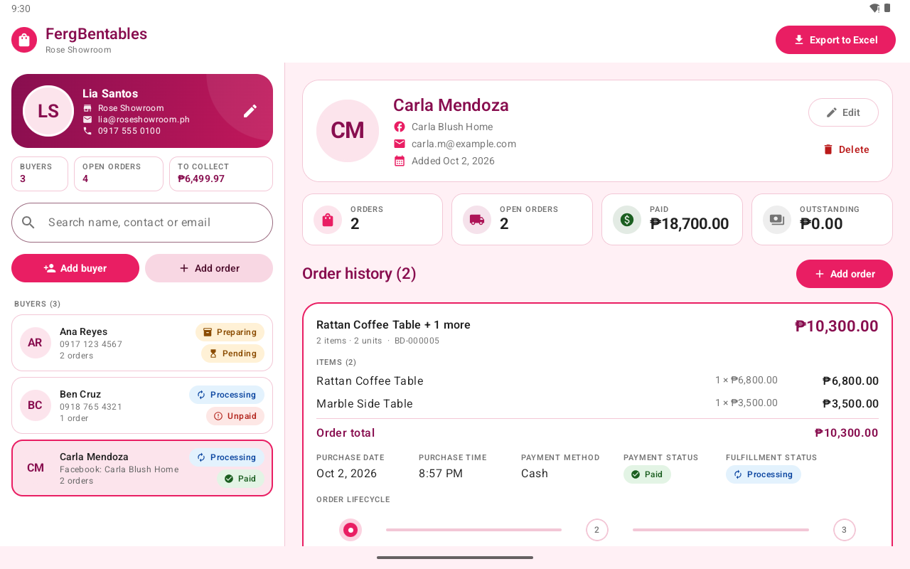
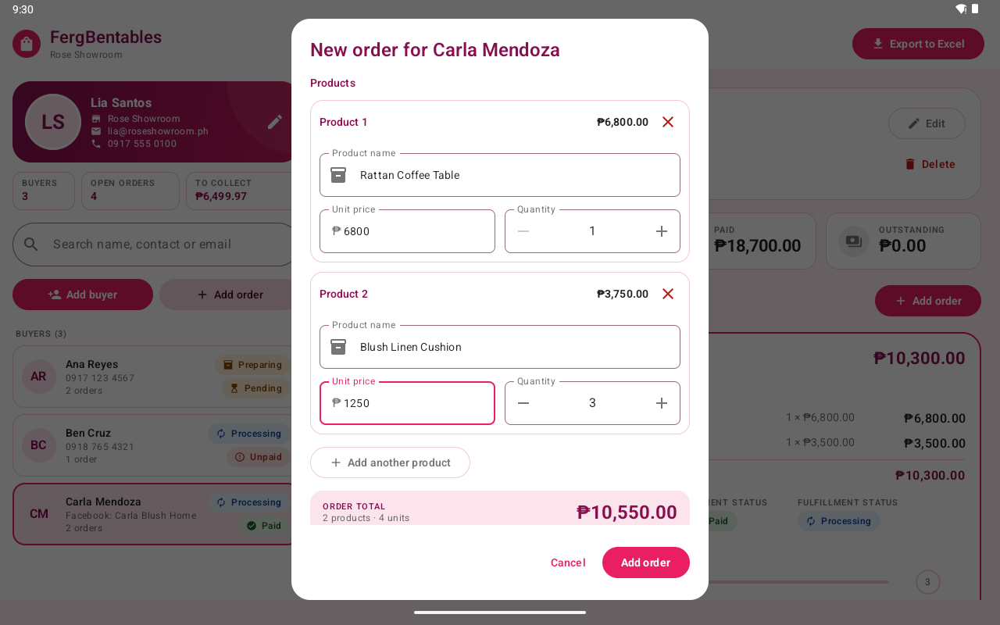
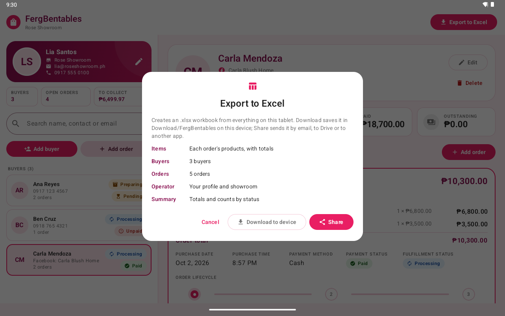
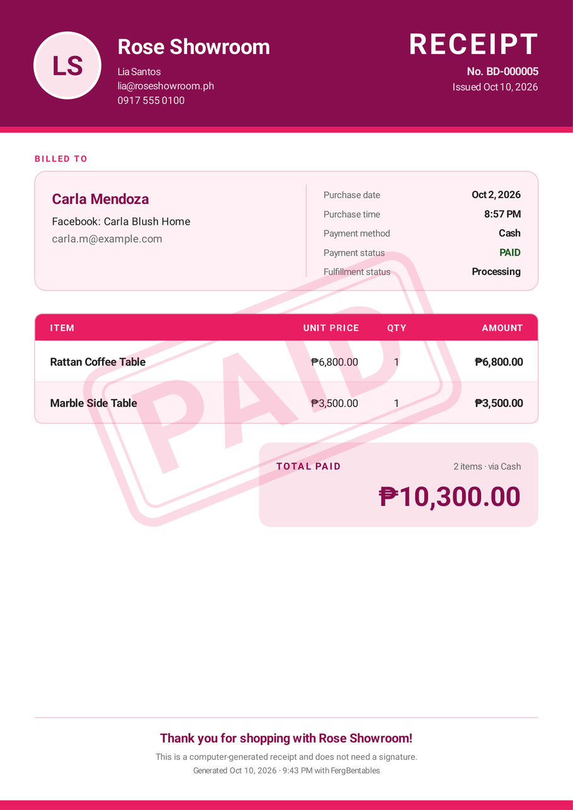
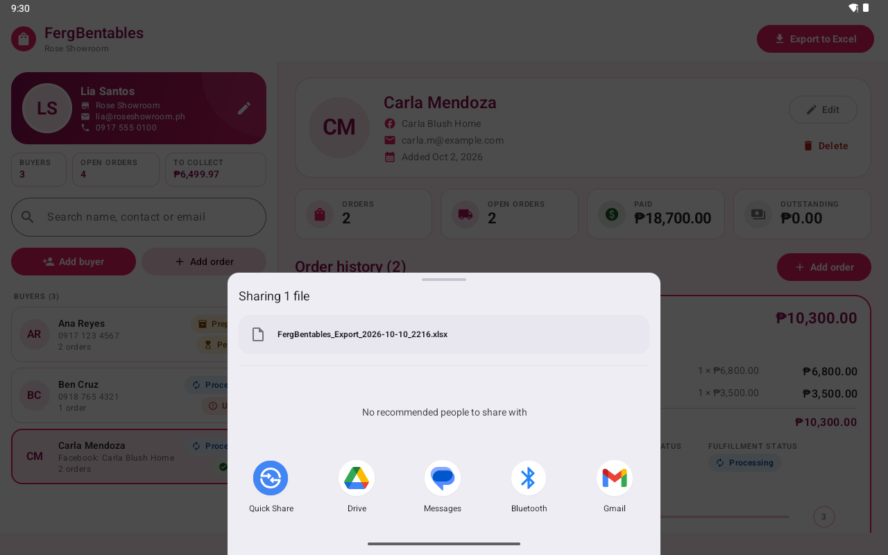

# FergBentables

An offline Android tablet app for running a showroom counter. It keeps a list of buyers, records
what they bought, follows each order from processing to delivery, prints a PDF receipt for paid
orders and exports everything to Excel. Built with Kotlin, Jetpack Compose (Material 3) and Room,
with a custom pink design system.

The app started as BlushDesk. Only its package name, `com.blushdesk.app`, keeps that working
name. Changing the application id would make Android treat it as a different app,
so copies already in use could not be updated without losing their records.



## Features

**Operator profile.** A card at the top of the left pane shows the tablet user's photo, full
name, showroom, email and phone number. The app keeps one active profile. The first launch asks
for it, because every receipt carries it. The photo can be taken with the camera or picked with
the Android Photo Picker.

**Buyers.** Add, edit, search and delete buyers. A buyer has a full name, a contact number or a
Facebook name (at least one, or both), an optional email and a profile photo. The date added is set
automatically. Search matches the name, number, Facebook name or email. Each row in the buyer list
shows the photo, name, contact number (or "Facebook: name"), number of orders, and the
fulfillment and payment status of the latest order. Deleting a buyer deletes their orders too,
after a confirmation.

**Orders.** An order holds one or more products, up to 30. Each line has a product name, unit
price and quantity. The line total (unit price × quantity) and the order total (the sum of the
lines) are calculated as you type and are never typed in. An order also records the purchase
date and time (pickers), the payment mode (Cash or Online payment) and the payment status
(Unpaid, Pending or Paid). Money is a `BigDecimal` with two decimals, stored as whole centavos,
so totals never pick up rounding errors. "Online payment" only records how the buyer paid. The
app never makes a transaction.

**Order history and lifecycle.** The buyer's orders are listed newest first; a multi-product
order reads "Velvet Sofa + 2 more". The selected order expands to show every product line, its
purchase and payment details and a Processing → Preparing → Delivered progress component. One tap on "Move to …" advances it a single stage. Tapping a stage sets it
directly, which is how a mis-tap is undone. Delivered orders turn green.

**PDF receipts.** Only paid orders can get one. The button stays disabled with an explanation
otherwise, and the generator itself refuses unpaid orders. The A4 receipt has:
- the showroom details (operator, store, email, phone)
- the buyer's details (name, contact number and/or Facebook name, email)
- one itemized row per product with unit price, quantity and line total; long orders continue
  on further pages under a compact header, with "Page x of y"
- purchase date and time, payment method, payment status and fulfillment status
- a semi-transparent PAID stamp

The PDF is written to the app's private cache, copied to `Download/FergBentables/`, and can be opened
(to print) or shared from the app.

**Excel export.** "Export to Excel" in the top bar opens a dialog that lists what the workbook
contains and offers two ways to get it:

- **Download to device** saves the `.xlsx` in `Download/FergBentables/`, where the Files app (or a
  computer on a USB cable) finds it. A dialog then names the file and can open it in the
  installed spreadsheet app.
- **Share** opens the Android share sheet (Gmail, Drive, Messenger, Quick Share, ...).

Both hand over the same formatted workbook:

| Sheet    | Columns / contents |
|----------|--------------------|
| Items    | Opens first. Each order's products as Product Name, Quantity, Price, Total Amount, newest order first, with an order total under each order (marked Paid or Not Yet Paid) and a grand total at the end |
| Buyers   | Buyer ID, Full Name, Contact Number, Facebook Name, Email, Date Added, Number of Orders, Payment Status |
| Orders   | One row per product line: Order ID, Buyer ID, Buyer Name, Product, Unit Price, Quantity, Total Amount (that line), Purchase Date, Purchase Time, Payment Mode, Payment Status, Fulfillment Status, plus Order Total |
| Operator | Operator Name, Store Name, Email, Phone Number |
| Summary  | Total Buyers, Total Orders, Paid / Unpaid / Pending Orders, Processing / Preparing / Delivered Orders, Total Recorded Sales |

The Items sheet was added to read orders on a tablet. Its totals are Excel formulas, so they
recalculate if someone edits a quantity or price. The app also stores each formula's result, so
previewers that never calculate (mail and Drive viewers) still show the numbers. The Orders sheet
keeps the specification's twelve columns. "Order Total" was added when orders gained several
products, "Facebook Name" when buyers could be reached on Facebook, and "Payment Status" so a
printout shows who still owes: a buyer is Paid once every order is paid, Not Yet Paid while any
order is Unpaid or Pending, and "No orders" before their first order. Headers are styled and
frozen, the Buyers and Orders tables have filters, money uses a peso currency format, dates and
times are real Excel dates, and status cells are color coded.

The file is a plain ZIP: every part carries its size and checksum in its own header, the way Excel
saves files. Apache POI streams the parts instead, leaving those fields empty. Desktop Excel
accepts that, but Excel for Android refuses such a file and calls it password-protected.

| New order with several products | Export dialog | Paid receipt | Share sheet |
|---|---|---|---|
|  |  |  |  |

**Layout.** The app is designed for a landscape tablet: buyers on the left, the selected buyer's
dashboard on the right. Windows narrower than 600dp (phone, split screen) switch to one pane at a
time with a back arrow. This matters because Android 16+ ignores orientation locks on large
screens. An open form keeps what was typed when Android recreates the screen (a display-size
change) or closes the app in the background. The selected buyer and order come back too. Once
something has been typed, Back and Cancel ask "Discard changes?" before closing the form. With a
floating keyboard, Back closes the form rather than the keyboard, so this guards against losing a
half-entered order by accident.

**Errors.** Messages are written for the operator. A broken rule, such as "Enter a valid phone
number" or "Mark the order as paid before issuing a receipt", is shown as written. Any other
failure is logged and replaced by a generic message, so raw database or library errors never
reach the screen. Error snackbars use the error colors and an icon.

## Offline by design

There is no Firebase, back end, REST API, login or cloud sync, and the manifest does not declare
the `INTERNET` permission. Everything is stored in a local Room database, and the app works the
same in airplane mode.

## Tech stack

| Area | Choice |
|---|---|
| Language | Kotlin 2.4, coroutines and Flow |
| UI | Jetpack Compose, Material 3 (Compose BOM 2026.09) |
| Architecture | MVVM with a repository (interface in `domain`, Room implementation in `data`), a small hand-written dependency container |
| Database | Room 2.8 (KSP): entities, DAO, type converters, relations, exported schemas and tested migrations |
| Excel | Apache POI 5.5 (`poi-ooxml`) |
| PDF | Android's built-in `PdfDocument` canvas |
| Images | Coil 3, `ExifInterface` |
| Build | AGP 9.4, Gradle 9.8, compileSdk 37, targetSdk 37, minSdk 29 (Android 10) |

## Project structure

```
app/src/main/java/com/blushdesk/app/
├── data/
│   ├── local/database/   AppDatabase, ShowroomDao, Entities (OperatorProfile, Buyer, Order),
│   │                     Relations (BuyerWithOrders, ...), Converters, Migrations
│   └── repository/       OfflineShowroomRepository (Room implementation)
├── domain/
│   ├── model/            Enums (PaymentMode, PaymentStatus, FulfillmentStatus), BuyerDetail,
│   │                     ExportSnapshot, UserFacingException
│   └── repository/       ShowroomRepository (interface)
├── ui/
│   ├── theme/            ShowroomPinkTheme: Color, Type, Shape, Dimens, Theme
│   ├── components/       OperatorProfileCard, BuyerList, BuyerListItem, SearchBar, OrderCard,
│   │                     OrderStatusBadge (+ FulfillmentProgress), PaymentStatusBadge, StatCard,
│   │                     EmptyState, LoadingIndicator, ShowroomSnackbar, FormDialog, ...
│   ├── showroom/         ShowroomTabletScreen, ShowroomViewModel, ShowroomUiState, MasterPane
│   ├── buyer/            AddBuyerDialog, EditBuyerDialog, BuyerDetailScreen, BuyerDetailHeader
│   ├── order/            AddOrderDialog, EditOrderDialog, OrderDetailCard, OrderHistory, ReceiptReadyDialog
│   ├── operator/         EditOperatorProfileDialog
│   └── export/           ExportDialog
├── utils/                PdfReceiptGenerator, ExcelExporter, DocumentService, Money, Validation,
│                         Formats, PhotoStorage, DownloadsSaver, AppFiles, Sharing
├── di/                   AppContainer
└── MainActivity.kt, FergBentablesApp.kt
```

Data flows one way. Room emits `Flow`s, `ShowroomViewModel` combines them into one immutable
`ShowroomUiState`, and the screen renders that state and calls view model functions.
Composables never touch the database. One-off results (success, error, "receipt ready", "share
this workbook") arrive as events. The view model depends only on interfaces, so its unit tests
run on the JVM with fakes.

### Database

```
operator_profile (one active row)   buyers 1 ──── * orders 1 ──────────────── * order_items
  fullName, storeName, email,          id, fullName,           id, buyerId (FK, CASCADE),     id, orderId (FK, CASCADE),
  phoneNumber, profileImageUri,        contactNumber,          totalAmount, purchaseDateTime, position, productName,
  createdAt, updatedAt                 facebookName, email,    paymentMode, paymentStatus,    unitPrice, quantity,
                                       dateAdded,              fulfillmentStatus,             lineTotal
                                       profileImageUri,        createdAt, updatedAt
                                       createdAt, updatedAt
```

- Money is `BigDecimal` in code and centavos (INTEGER) in SQLite, so SQL `SUM()` is exact. A third
  decimal is rejected, never rounded.
- `lineTotal` (unit price × quantity) and `totalAmount` (sum of lines) are stored for reporting
  but recomputed on every save. An order and its lines are written in one transaction, and editing
  an order replaces its lines. `createdAt` / `updatedAt` are stamped by the repository.
- Enums are stored by name, so reordering them cannot relabel old rows.
- The DAO has explicit queries for:
  - CRUD
  - search
  - observing buyers, the selected buyer and their orders
  - order totals
  - orders by payment status and by fulfillment status
  - the export data
- The schema is exported to `app/schemas/`. Three hand-written migrations are tested with Room's
  `MigrationTestHelper`:
  - version 1 → 2 moved to this specification's field names
  - version 2 → 3 moved products into `order_items`; each old order becomes an order with one line
  - version 3 → 4 added `facebookName`; existing buyers keep their number and get an empty one
- There is deliberately no destructive fallback: this is the shop's only copy of its records.

## Permissions, files and privacy

The app requests **no runtime permissions** and declares none of its own. The only entry in the
built APK is `DYNAMIC_RECEIVER_NOT_EXPORTED_PERMISSION`, which androidx.core adds. It is
signature-level and private to the app, and users never see it.

- **Gallery photos** come through the Photo Picker, so the user hands over one image.
- **Camera photos** are taken by the device's camera app, which writes to a FileProvider URI.
  The app never needs the `CAMERA` permission.
- **Receipts and downloaded Excel files** are copied into Downloads through MediaStore, which needs no storage permission on Android 10+.
- **Sharing** uses `content://` URIs from a FileProvider, and `res/xml/file_paths.xml` exposes
  only the `receipts/`, `exports/` and `camera/` cache folders. A test checks that anything else,
  including the database, is refused.
- **Photos** are downsized (longest edge 1024 px) and kept in private storage. Replaced or
  abandoned photos are deleted.
- **Backups** are off, both cloud and device-to-device, because the database holds customers'
  personal details.

## Design system

`ShowroomPinkTheme` builds a Material 3 color scheme from the brand palette:
- Soft Pink `#FCE4EC`
- Vibrant Rose `#E91E63`
- Deep Magenta `#880E4F`
- Lavender Blush `#FFF0F5`
- White
- dark text `#212121`
- muted text `#757575`

Colors, typography, shapes and dimensions live in `ui/theme`; composables do not hard-code them.

`#757575` falls below the 4.5:1 contrast minimum on the pink surfaces. Gray text placed on pink
uses a darker on-tint variant (`#666666`), and the master pane is white.

Status badges pair color with an icon and a word, so they are readable without telling colors apart.

## Building and running

Requirements: Android Studio (its bundled JDK works; tested with JBR 25) and the Android SDK with
platform 37 installed.

```bash
./gradlew :app:assembleDebug        # build the APK
./gradlew :app:installDebug         # install on a running emulator or device
```

For the intended experience use a tablet emulator in landscape (for example a 10.1" WXGA profile).
On first launch the app asks for the operator's profile.

### Release build

Release builds are shrunk with R8, which brings the APK from about 70 MB down to about 13 MB. They
are signed when a `keystore.properties` file sits at the project root.

1. Create a signing key once. Keep the key file and its password safe: an installed release can
   only be updated by an APK signed with the same key. `keytool` comes with Android Studio's JDK.

   ```bash
   keytool -genkeypair -keystore ~/.android/blushdesk-release.jks -storetype PKCS12 -alias blushdesk -keyalg RSA -keysize 4096 -validity 10000
   ```

2. Copy `keystore.properties.example` to `keystore.properties` and fill it in. Git ignores
   `keystore.properties` and every `*.jks` / `*.keystore` file.
3. Build:

   ```bash
   ./gradlew :app:assembleRelease      # app/build/outputs/apk/release/app-release.apk
   ```

Without `keystore.properties` the same command still builds, but the APK is unsigned.

Apache POI loads schema classes and data files by name, so `app/proguard-rules.pro` tells R8
what to keep. A missing rule does not fail the build. It shows up only when the app runs, as
"Couldn't create the Excel file", with the cause in logcat. After changing dependencies or those
rules, install the release APK and do an Excel export and a receipt before shipping it.

## Tests

```bash
./gradlew :app:testDebugUnitTest            # 77 JVM tests, no device needed
./gradlew :app:connectedDebugAndroidTest    # 84 tests on a running emulator or device
```

- **Unit tests:**
  - money (parsing, totals, centavos), validation, date formats, enums and converters, LIKE escaping
  - the Excel workbook (sheets, exact columns, values, formats, the Items formulas and their stored
    results, the plain ZIP layout; POI on the JVM)
  - the theme's color initialization
  - the view model against fakes: selection (including after the app is closed in the background), order expansion, totals, lifecycle, deletes, friendly errors, exports
- **Instrumented tests:**
  - every DAO query on real SQLite (cascade delete, foreign keys, latest-order status, totals, status lists, export summary, search with `%` and `_`)
  - the v1 → v2 → v3 → v4 migrations
  - the repository rules (recomputed totals, timestamps, validation, photo cleanup)
  - Apache POI on Android's runtime, formula results included
  - PDF generation rendered back to pixels
  - photo import, Downloads saving (receipts and the workbook, byte for byte), FileProvider rules
  - the screens, with Compose UI tests:
    - the order form: a new line scrolls into view with the cursor in it, totals follow what is typed, saving hands over every line
    - closing a form: an untouched or unchanged form closes at once; one with typed input asks first, and "Keep editing" keeps it
    - the buyer form: a contact number or a Facebook name
    - the export dialog: Download to device and Share as separate choices, both held back while the workbook is made or when there is nothing to export, and the "saved" dialog naming the file and folder
    - the whole screen keeping an open form and what was typed when it is recreated

The PDF test writes PNG renders of each receipt to the app's `files/test-artifacts/` so a person
can look at the output.

## Configuration

- **Currency:** `Money.SYMBOL` in `utils/Money.kt` (peso by default). The PDF and Excel formats follow it.
- **Brand colors:** `BrandPalette` in `ui/theme/Color.kt` feeds the Compose theme, the PDF and the Excel styles.
- **Logo:** `docs/logo/fergbentables-logo.svg` is the bow-and-doily artwork, drawn as vectors with the
  lettering as outlines. The launcher icon's foreground and themed-icon layers (`mipmap-*`), the
  Android 12+ splash logo (`drawable-*/splash_logo.png`) and `app/src/main/ferglogo-playstore.png`
  are PNGs rendered from it for each screen density.

## Known limitations

- **The release build is checked by hand.** The automated tests run against the debug build. The
  shrunk, signed release build was checked on the emulator: profile, buyers (including one reached
  only on Facebook), a multi-product order, receipt, sharing, Excel export (pulled off the device
  and checked on a PC, formula results included) and photo import.
- **Excel for Android itself is untested here.** The emulator has no signed-in Play Store, so the
  "password-protected" fix was checked against the file format (every ZIP header filled in, as
  Excel writes them), not by opening the file in Excel for Android.
- **Light theme only**, on purpose: the pink palette is the brand.
- **Test coverage:** tested on an Android 15 (API 35) tablet emulator, not yet on an Android 16+
  device or real hardware.
